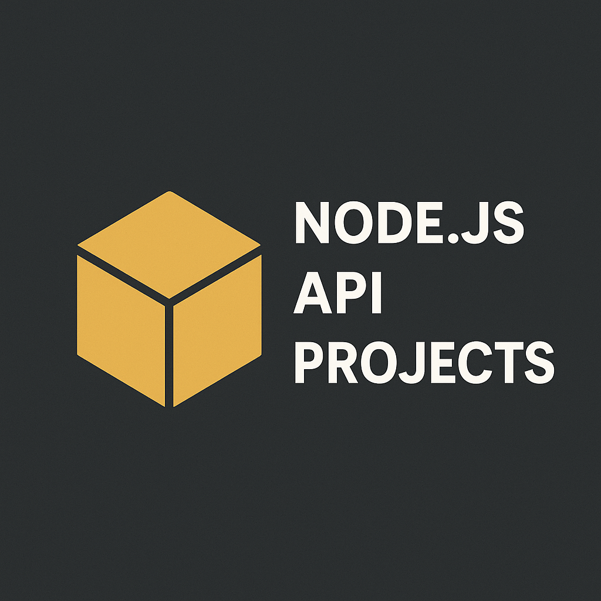

<header style="display: flex; gap: 1rem; align-items: center;">
  <p>
    
  </p>
  <h1 style="text-align: center;">🌐 Création d'API RESTful avec Node.js, Express et MongoDB</h1>
</header>


Ce dépôt regroupe **trois API RESTful** développées avec **Node.js**, **Express** et **MongoDB**, chacune couvrant un cas d’usage courant dans le développement backend : l’authentification, la gestion d'une bibliothèque, et une to-do list.

📁 [Accéder au dépôt GitHub](https://github.com/chanwinharold/Creation_API_RESTful)

---

## 📦 Structure du projet


Creation\_API\_RESTful/  
├── auth-api/ ...............# API d'authentification (signup, login)  
├── library-api/.............# API de gestion de bibliothèque + auth  
├── todo-api/ ...............# API de gestion de tâches + auth  
└── README.md


---

## 🔐 1. auth-api – Authentification des utilisateurs

### ✅ Fonctionnalités
- Inscription (`POST /api/auth/signup`)
- Connexion (`POST /api/auth/login`)
- Génération de JWT
- Hashage des mots de passe (bcrypt)

### 🔧 Démarrer l’API
```bash
cd auth-api
npm install
npm run dev
````

### 🔑 Exemple de `.env`

```env
PORT=3001
DB_URI=mongodb://localhost:27017/auth-db
JWT_SECRET=une_clé_secrète_très_forte
```

---

## 📚 2. library-api – Gestion de livres avec authentification

### ✅ Fonctionnalités

* Authentification (signup/login avec JWT)
* CRUD de livres :

  * `POST /api/books`
  * `GET /api/books`
  * `GET /api/books/:id`
  * `PUT /api/books/:id`
  * `DELETE /api/books/:id`
* Sécurité : chaque livre appartient à un utilisateur

### 🔧 Démarrer l’API

```bash
cd library-api
npm install
npm run dev
```

### 🔑 Exemple de `.env`

```env
PORT=3002
DB_URI=mongodb://localhost:27017/library-db
JWT_SECRET=une_clé_secrète_très_forte
```

---

## 📝 3. todo-api – API de gestion de tâches

### ✅ Fonctionnalités

* Authentification utilisateur avec JWT
* CRUD de tâches :

  * `POST /api/tasks`
  * `GET /api/tasks`
  * `GET /api/tasks/:id`
  * `PUT /api/tasks/:id`
  * `DELETE /api/tasks/:id`
* Sécurité : chaque tâche est liée à l’utilisateur connecté

### 🔧 Démarrer l’API

```bash
cd todo-api
npm install
npm run dev
```

### 🔑 Exemple de `.env`

```env
PORT=3003
DB_URI=mongodb://localhost:27017/todo-db
JWT_SECRET=une_clé_secrète_très_forte
```

---

## 🛠️ Technologies utilisées

* **Node.js** & **Express**
* **MongoDB** + **Mongoose**
* **JWT** pour l'authentification
* **bcrypt** pour le hashage des mots de passe
* **dotenv** pour la gestion des variables d'environnement
* **nodemon** pour le développement

---

## 📬 Contact

Développé avec passion par **Harold Chanwin**  
📎 [LinkedIn](https://www.linkedin.com/in/harold-chanwin-profile)  
📫 N’hésitez pas à me contacter pour toute suggestion ou collaboration !

---

## 🧪 Tests Postman (facultatif)

> Si tu veux aller plus loin, pense à ajouter une collection Postman pour tester les routes facilement.

---

## 📄 Licence

Ce projet est open-source, sous licence **MIT**.
Tu peux l’utiliser, le modifier et le partager librement.

---
